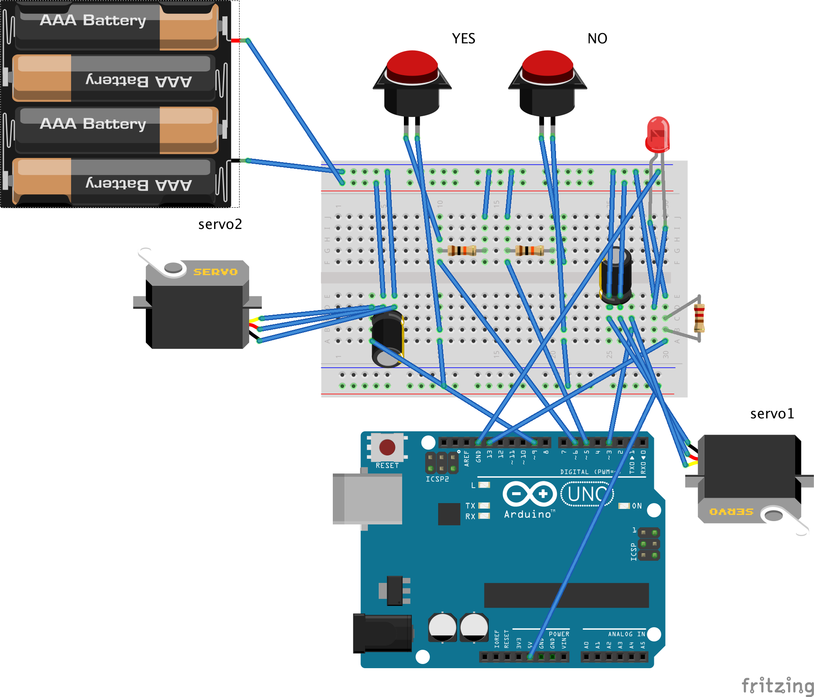

# How To Build

In quite the opposite spirit to black boxing, here is a basic guide to build it yourself. Arduino abstractions of `C++`, how capacitors, pull up resistors, ground referencing etc work alongwith 300 years of microscopic practice and the physics of ball lenses remain in the black boxes we need them to be in to play this kind of non-human observing crazy golf. 

## Box

We used 3mm Black Acrylic (see [BOM.md](BOM.md) ) to make the box using [MakerCase](https://www.makercase.com/)

## Golf Ball internals

We used the Core.scad file to generate 3 parts using [OpenSCAD](http://www.openscad.org) to make `.stl` files which we then used Cura to generate gcode for an Ultimaker 2+ 3d printer usign 4mm PLA filament on gradual 0-80% infill.

2 Hextronik 9 g Micro Servos push a golf ball out of it's recess once entering the box, and then guide it via a 3d printed modified pinball flipper in a golf run, controlled by arduino, code included in this repo

We drilled holes in the underside of the 3d printed internals/golf runs 5mm offset for 3mm [nylon standoff/spacers](https://www.ebay.co.uk/itm/Nylon-M2-M2-5-M3-Hex-Column-Male-Female-Screw-Nut-Kit-Box-Standoff-Spacers/163465286260). Each M3 standoff included a 15mm threaded bolt, a 4mm nut, a securing 2mm nut and a 20mm high threaded spacer to secure the 3d printed interals, and leave space for a standard 300 hole PCB breadboard and Arduino. The standoffs fitted and secured the arduino between the base of the box and the 3d printed internals.

A standard nylon M3 spacer kit should give you the parts you need to secure internals by threading the main 15mm screw from the underside of the base of the box.

The 3d printed parts sat on the threaded spacers and the nylon gave some flexibility for construction or repair.

## Arduino and Wiring

2 [Sanwa style arcade buttons](https://www.ebay.co.uk/itm/Genuine-White-Sanwa-SDM-18-Snap-In-Arcade-Button-18mm-Mounting-Hole/392317047559) triggers servos controlled by arduinio standard servo library and also lit up a large 10mm LED to indicate a successful button press. Refer to the Arduino code and wiring diagram provided

We used bell wire to run cabling from the underside of the arcade buttons (soldered on) to the solderless wires on the breadboard and did everything else wiring wise using coloured coded jump wires. The main thing to note is to power the 2 5V servos seperately from the arudino but with a shared ground reference. So 4 x AAA 1.5v batteries is adequate and a 9V battery powers the arduino. These need external on/off switches but we only had time to provide space to access the battery packs. This should be added alongwith a veroboard soldered breadboard or shield for a more robust build. However a solderless breadboard build worked really well.

## Setup and Useage

 * Take the black box and attach a 9V battery to the 9V battery clip on the left of the box
 * Turn the battery pack on the right side on
 * Place the box right by the final hole so the OUT hole on the left will let the golf ball roll into the hole. 
 * Use the silver folding camp stove windshields to capture the ball from the right OUT hole and make a curve so the player has to make several putts to escape
 * Arrange the broken vinyl records to support the black acrylic ramp into the IN hole use the silver gaffa tape to support it
 * Place the ramp, long piece first into the IN hole to guide the ball into the capture zone, a ball shaped cup that the ball falls into when you putt the ball up the ramp. Use the gaffa to secure it.
 * Press the white button to reset the system and green light will flash. Buttons need to be pressed firmly and held for a second then released to register. After 5 second you will hear the internal servos reset to the starting ball capturing positions.
 * You are now ready to play and follow the printed instructions
 * When the ball is captured follow these YouTube instructions on how to see the algae swimming in the record grooves using the paper foldscope microscopes provided. https://youtu.be/VdcvPJWPRNE
   * Basically hold them blue side up and place finger on and thumb around the blue tabs with a semi circular pattern of holes. The video describes it best.
 * Our foldscopes have prepared slides already loaded with algae and their environments. They also have led light packs that help viewing indoors but sunlight is best. Warn young players not to look directly into the sun.
   * They are looking for tiny green tube like creatures swimming in the grooves
   * Don't worry about enforcing wearing costumes! People are quite happy to just mime with their bodies which I think is good enough!
   * Let them decide which button to press!

## Notes

It's worth having someone to help with the scopes and encouraging people how to use it especially if the course gets busy. It's not very stand alone I'm afraid but it's a good way of taking to participants!

## Issues

Sometimes after pressing the black button the internal servo fails to reset into the ball capturing position. This means players can putt the ball straight through and win. This is just good luck on their part! By pressing the white button with no ball present, this seems to reset the servo correctly.

