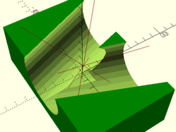

# Black Box Golf
Make files, instructions and details of a Science & Technology Studies Crazy Golf hole for [Full Of Noises 2019](http://fonfestival.org/event/full-of-noises-2019-09-11-08-19/) in Barrow Park, Barrow-in-Furness

## Premise

Black Boxing is where a very complicated technology (like a computer or a bank) effectively becomes a box hiding how it works: all we know is we put something in and something comes out. Most of the things we use every day can be seen like this.

A player's ball enters a compartment in a 450mmx450mmx650mm black box from a short run and is held within the structure and only released after the 'success' or 'failure' of a condition. A 'success' triggers the ball's release down another run advantageous to the player's next hole, while a 'fail', releases the ball somewhere not to the players advantage, ie away from the next hole

The success or fail is triggered by 2 physical buttons that a human judge can operate. It is arduino based and will run from a rechargeable 3V-5V USB battery pack

Players act out instructions provided on the box on the day, that fellow players, friends or family judge whether they deserve a `success` or `fail`. They have to be honest or they can cheat; it's up to the players.

The black box can be deployed as a kit for future crazy golf at Barrow Park and the conditional system can change each time.

Like much of the tech we all depend on, this hole promises alot, but ultimately provides very little; obscuring hidden communities of humans and non-humans who maintain the infrastructures they depend on.
