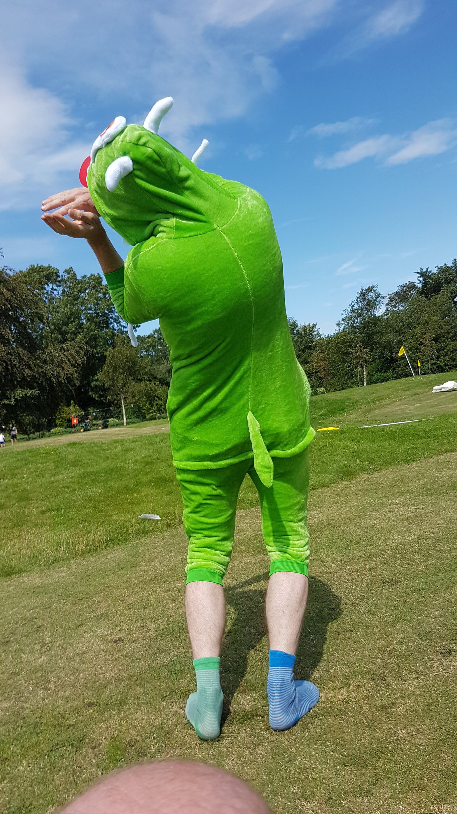

# Black Box Golf
Make files, instructions and details of a Science & Technology Studies Crazy Golf hole for [Full Of Noises 2019](http://fonfestival.org/event/full-of-noises-2019-09-11-08-19/) in Barrow Park, Barrow-in-Furness

## Premise

Black Boxing is where a very complicated technology (like a computer or a bank) effectively becomes a box hiding how it works: all we know is we put something in and something comes out. Most of the things we use every day can be seen like this.

A player's ball enters a compartment in an acrylic black box from a short run and is held within the structure and only released after the 'success' or 'failure' of a condition. A 'success' triggers the ball's release down another run advantageous to the player's next hole, while a 'fail', releases the ball somewhere not to the players advantage, ie away from the next hole

The success or fail is triggered by 2 physical buttons that a human judge can operate. It is arduino based and will run from a rechargeable 3V-5V USB battery pack

Players act out instructions provided on the box on the day, that fellow players, friends or family judge whether they deserve a `success` or `fail`. They have to be honest or they can cheat; it's up to the players.

The black box can be deployed as a kit for future crazy golf at Barrow Park and the conditional system can change each time.

Like much of the tech we all depend on, this hole promises alot, but ultimately provides very little; obscuring hidden communities of humans and non-humans who maintain the infrastructures they depend on.

### Black Box activity

Players judge a true or false button press based on observing algae in specially prepared microfluidic environments on microscope slides using Manu Prakesh's [Foldscopes](https://foldscope.com) made at the [Prakesh Lab](https://web.stanford.edu/group/prakash-lab/cgi-bin/labsite/) for 'frugal science'.

#### Euglena Cosplay

Euglena Cosplay is the activity used to qualify true or false conditions in the black box golf ball.

 * Enter golf ball into box
 * Observe Euglena down *Microscope Alley* with pre-prepared [Foldscopes](https://foldscope.com) or failing that on the [model organisms webpage](https://domesticscience.org.uk/criticalkits/euglena.html)
   * They observe Euglena in silicon microfluidic channels moulded from the grooves of Cumbrian charity shop records, a method for model organism observation developed by microbiologist, biotechnologist and engineer [Alexandre Benedetto](https://www.lancaster.ac.uk/health-and-medicine/about-us/people/alexandre-benedetto) inspired by an article in [The Worm Breeders Gazette](http://wbg.wormbook.org/2017/07/18/immobilizing-nematodes-for-live-imaging-using-an-agarose-pad-generated-with-a-vinyl-record/)
    * Wear a Euglena costume and mime their behaviour
    * If you're too embarassed wear a Euglena truckers cap
 * Get judged by co-players
 * Hit `true` or `false` buttons
 * Golf ball released:
   * `true`: easy access to next hole
   * `false`: Down a camping stove/ recycled PLA windshield maze

# How To Build

In quite the opposite spirit to black boxing, read [the basic guide to build it yourself](HowToBuild.md). Arduino abstractions of `C++`, how capacitors, pull up resistors, ground referencing etc work alongwith 300 years of microscopic practice and the physics of ball lenses remain in the black boxes we need them to be in to play this kind of non-human observing crazy golf. 

